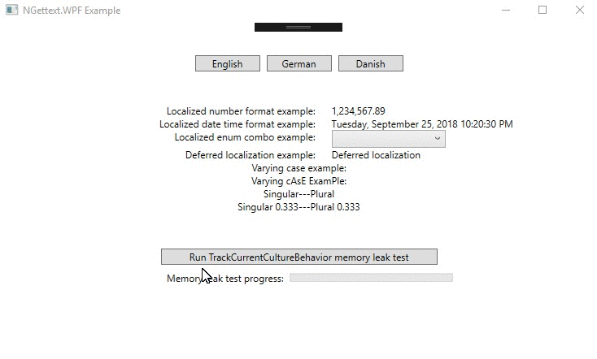

# ngettext-wpf
Proper internationalization support for WPF (via NGettext)

[](https://ci.appveyor.com/project/robert-j-engdahl/ngettext-wpf)

## Getting Started
NGettext.Wpf is intended to work with dependency injection.  You need to call the following at the entry point of your application:

```c#
NGettext.Wpf.CompositionRoot.Compose("ExampleDomainName");
```

The `"ExampleDomainName"` string is the domain name.  This means that when the current culture is set to `"da-DK"` translations will be loaded from `"Locale\da-DK\LC_MESSAGES\ExampleDomainName.mo"` relative to where your WPF app is running (You must include the .mo files in your application and make sure they are copied to the output directory).

Now you can do something like this in XAML:

```xml
<Button CommandParameter="en-US" 
        Command="{StaticResource ChangeCultureCommand}" 
        Content="{wpf:Gettext English}" />
```
Which demonstrates two features of this library.  The most important is the Gettext markup extension which will make sure the `Content` is set to the translation of "English" with respect to the current culture, and update it when the current culture is changed.  The other feature it demonstrates is the `ChangeCultureCommand` which changes the current culture to the given culture, in this case `"en-US"`.

Have a look at <a href="NGettext.Wpf.Example/UpdateTranslations.ps1">NGettext.Wpf.Example\UpdateTranslations.ps1</a> for how to extract msgids from both xaml and cs files.  

Note that the script will initially silently fail (i.e. 2> $null) because there is no .po file for the given language.  In the gettext world you are supposed to create that with the <a href="https://www.gnu.org/software/gettext/manual/html_node/Creating.html">msginit</a> command that ships with the <a href="https://www.nuget.org/packages/Gettext.Tools/">Gettext.Tools</a> nuget package, or PoEdit can be used to initialize the catalog from the intermediate pot file created.  Here is what recently worked for me:

```
PM> mkdir -p Locale\en-GB\LC_MESSAGES\
PM> msginit --input=obj\result.pot --output-file=Locale\en-GB\LC_MESSAGES\ExampleDomainName.po --locale=en_GB
```

---

## Conventions
Keep your compiled translations in `"Locale\<LOCALE>\LC_MESSAGES\<DOMAIN>.mo"`.  This library will force you to follow this convention.  Or rather, NGettext forces you to follow a convention like `"<PATH_TO_LOCALES>\<LOCALE>\LC_MESSAGES\<DOMAIN>.mo"`, and I refined it.

Keep your raw translations in `"Locale\<LOCALE>\LC_MESSAGES\<DOMAIN>.po"`.  This is not enforced, but when working with POEdit it will compile the `".mo"` file into the correct location when following this convention, and it doesn't remember your previous choice, so stick with the defaults.

There are lots of GNU conventions related to internationalization (i18n) and localization (l10n).  One of them is that the notion that the original program is written in US English, so you don't need to translate anything to facilitate internationalization.  The original text in US English is called the `msgId`.

---

## Support

Reach out to me at one of the following places!

- Twitter at <a href="https://twitter.com/robert_engdahl" target="_blank">`@robert_engdahl`</a>
- LinkedIn at <a href="https://www.linkedin.com/in/robertengdahl/" target="_blank">`robertengdahl`</a> 
- or create an <a href="https://github.com/robert-j-engdahl/ngettext-wpf/issues">issue</a>

---

## Sample Application

In <a href="NGettext.Wpf.Example/">NGettext.Wpf.Example/</a> you will find a sample application that demonstrates all the features of this library.



